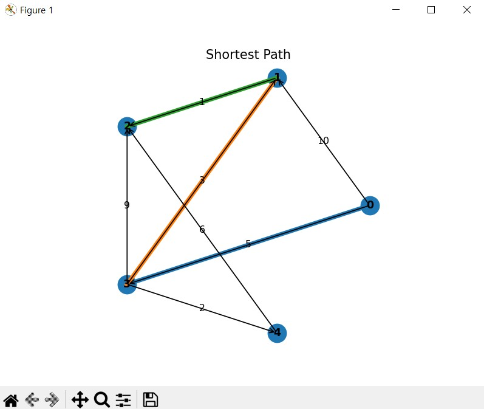
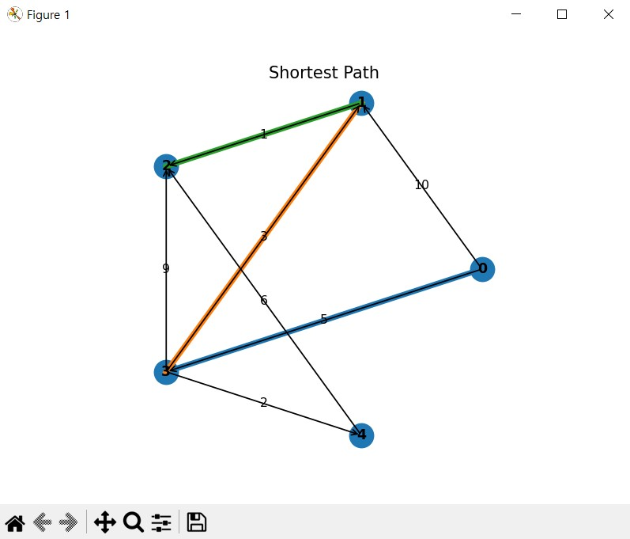

# PATH-PLANNING-COMPARISON

This project implements and compares **Dijkstra** and **Astar** with the same input format, as methods for **path planning in autonomous driving (mobile robotics)**.

- **Dijkstra**: Guarantees the shortest path using only the actual cost `g` without a heuristic. It visits nodes from the start to the goal while relaxing edge weights to search for the shortest path.

- **A\***: Prioritizes nodes that minimize `f = g + h` using a coordinate-based **Euclidean heuristic** `h`. Instead of visiting every node, it visits only nodes that minimize `f = g + h` to find the shortest path.
  - Coordinates (`coords`) are used **only for heuristic evaluation**, and the edge weight matrix `W` (road cost/speed/constraints) remains the **true** cost.  
  - When `h` is **admissible/consistent** (never overestimates and satisfies the triangle inequality), A\* guarantees optimality and typically explores **fewer nodes** than Dijkstra.


## Folder Structure
```
PATH-PLANNING-COMPARISON/
├─ assets/
│  ├─ Astar_result.jpg
│  └─ Dijkstra_result.jpg
├─ examples/
│  ├─ Astar_ex
│  ├─ Astar_unreachable_ex.txt
│  └─ dijkstra_ex.txt
├─ Astar.py
├─ Dijkstra.py
├─ License
├─ Readme.md
└─ requirements.txt
```

## Installation
```bash
pip install -r requirements.txt
```

## Run
**Dijkstra**
    
-  n m
- edges u v w X m lines
- s t


*Run with example file*
```bash
python Dijkstra.py < examples/dijkstra_01.txt
```
*Run with direct input*
```bash
python Dijkstra.py

5 7
0 1 10
0 3 5
1 2 1
3 1 3
3 2 9
3 4 2
4 2 6
0 2
```

**Run A\*  (coordinate-based heuristic)**
-  n m
- edges u v w X m lines
- coordinates x y X n lines
- s t

*Run with example file*
```bash
python AStar.py < examples/astar_01.txt
```
*Run with direct input*
```bash
python AStar.py

5 7
0 1 10
0 3 5
1 2 1
3 1 3
3 2 9
3 4 2
4 2 6
0 0
2 0
3 0
0 1
1 1
0 2
```

### Dijkstra


### A*



## Warnings 
- **Indexing/Direction**: Nodes are **0-based**. The graph is treated as a **directed graph**; if it is undirected, enter **both** `u v w` and `v u w`.
- **No negative weights**: Both algorithms assume **non-negative edges**.
- **INF constant**: `INF = 0xFFFF (65535)` denotes “no edge”.  
  - Choose weights so that the total path cost does not exceed `INF`.  
  - If large weights are needed, it is recommended to change to a **larger value** such as `INF = 10**15`.
- **Coordinates & scale**: In A\*, coordinates `coords` are **for heuristic calculation**. `coords[i]` must **exactly match node i in order**.  
  - If the units of edge cost (time/cost) and coordinate distance differ greatly, `h` can be **overestimated**. If necessary, lower the scale with `h = α·distance (0<α≤1)`.
- **Optimality condition**: To maintain **optimality**, A\* requires the heuristic to be **admissible/consistent** (Euclidean distance is usually safe).
- **Unreachable handling**: If no path exists, it prints `"Unreachable"`. In that case, skip distance aggregation/visualization.
- **Performance**: This implementation uses a **linear scan** instead of a priority queue, so the complexity is roughly `O(V^2 + E)`. Use `heapq` for large graphs.
- **Visualization**: `matplotlib` is required. In environments where display is difficult (server/WSL), use a backend setting or save to file (e.g., `plt.savefig`).


## Autonomous-driving perspective (summary)
- **Problem context**  
  - A **graph-based** comparison focused on **global planning**.  
  - **Real-world costs** such as road networks/lanes/intersections/tolls are in the adjacency matrix `W`,  
    while **geometric cues** for “how close to the goal” are captured by A\*’s **heuristic**.

- **Dijkstra**  
  - **Pros**: **Guarantees the shortest path** without a heuristic; simple; good as a baseline.  
  - **Cons**: Lacks goal direction, so **the search range can become wide** (slow on large maps).  
  - **Recommended use**: When the number of nodes is small, or when a heuristic is hard to define (e.g., special cost rules).

- **A\***  
  - **Pros**: **Goal-directed search** via `f = g + h` → typically faster (fewer expansions).  
  - **Condition**: **Optimality guaranteed** when `h` is **admissible/consistent**.  
  - **Recommended use**: When coordinates are available, or in physical spaces (roads/maps) with straight-line/grid cues toward the goal.

- **Extensions / practical tips**  
  - **Heuristic strengthening**: On grids, **Octile/Manhattan** (depending on motion); on general graphs, reinforce with **Landmarks (ALT)**.  
  - **Algorithm variants**: **Weighted A\*** (faster, near-optimal), **D\* / D\* Lite** (map updates/replanning), **Hybrid A\*** (vehicle kinematics/steering).  
  - **Post-processing**: **Path smoothing** with splines/polylines, then apply controllers such as **Pure Pursuit/MPC**.  
  - **Safety margins**: Reflect **safety/comfort** with obstacle inflation and cost layers (lane keeping, speed limits, curve penalties).


## License
MIT © 2025 coffeepaek


